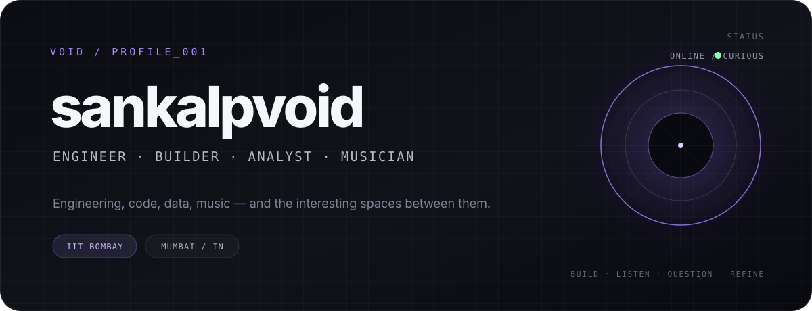
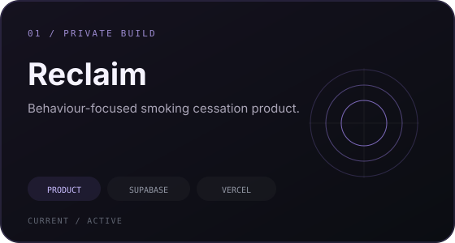
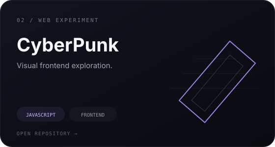
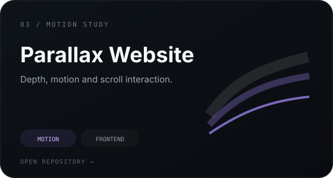
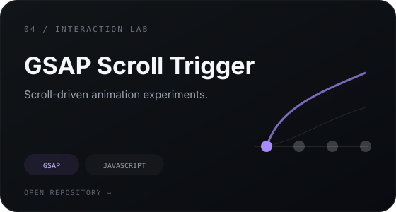
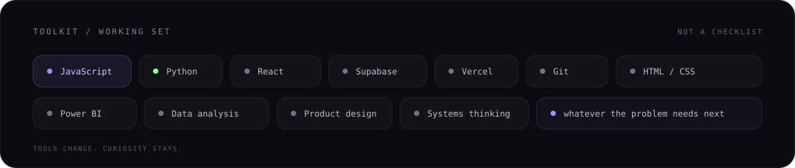
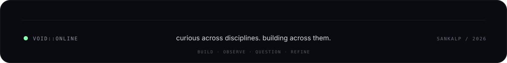

  

 

### `01` / signal

I’m **Sankalp** — an engineering student at **IIT Bombay** who likes working across disciplines instead of choosing one box and staying in it.

I’m drawn to **software, products, data, environmental systems, finance, design and behaviour** — especially when two or three of those collide into an interesting problem.

 

  

 

### `02` / selected transmissions

<table>
<tr>
<td width="50%" valign="top">
  
</td>
<td width="50%" valign="top">
  
</td>
</tr>
<tr>
<td width="50%" valign="top">
  
</td>
<td width="50%" valign="top">
  
</td>
</tr>
</table>

 

### `03` / working set

  

 

### `04` / field note

> I’m less interested in collecting labels than in getting better at understanding difficult problems — and building useful things around them.

 

  

