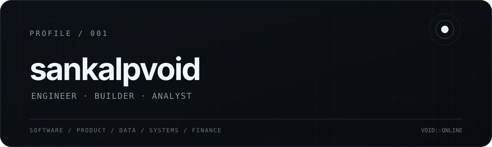

<div align="center">
  
</div>

<br>

### `01` / about

Engineering at **IIT Bombay**, with interests that refuse to stay in one lane.

I work across **software, product, data, environmental systems and finance**. I like understanding how things work, finding the interesting problem underneath the obvious one, and turning ideas into something tangible.

<br>

### `02` / current orbit

```text
building      →  Reclaim + small experiments
exploring     →  product engineering & thoughtful software
learning      →  data, analytics & finance
interested in →  systems, behaviour, design & real-world problems
```

<br>

### `03` / selected work

<table>
<tr>
<td width="50%" valign="top">

#### Reclaim

A behaviour-focused product exploring better ways to help people change their relationship with smoking.

`product` `javascript` `supabase` `vercel`

</td>
<td width="50%" valign="top">

#### [CyberPunk](https://github.com/sankalpvoid/CyberPunk)

An experimental frontend build from my exploration of visual web experiences.

`javascript` `frontend` `web`

</td>
</tr>
<tr>
<td width="50%" valign="top">

#### [Parallax Website](https://github.com/sankalpvoid/Parallax-Website)

Exploring depth, motion and interaction on the web.

`frontend` `interaction` `motion`

</td>
<td width="50%" valign="top">

#### [GSAP Scroll Trigger](https://github.com/sankalpvoid/GSAP-Scroll_Trigger)

Experiments with scroll-driven animation and interface movement.

`gsap` `javascript` `animation`

</td>
</tr>
</table>

<br>

### `04` / toolkit

<div align="center">

`JavaScript` &nbsp; `Python` &nbsp; `HTML/CSS` &nbsp; `React` &nbsp; `Supabase`  
`Git` &nbsp; `GitHub` &nbsp; `Vercel` &nbsp; `Power BI` &nbsp; `Data Analysis`

</div>

<br>

### `05` / beyond code

**Environmental systems** — engineering, sustainability and systems thinking.  
**Product** — behaviour, UX and solving actual user problems.  
**Data** — finding patterns and turning information into decisions.  
**Finance** — businesses, markets and quantitative thinking.

<br>

---

<div align="center">

<sub>curious across disciplines. building across them.</sub>

<br><br>

`VOID::ONLINE`

</div>
