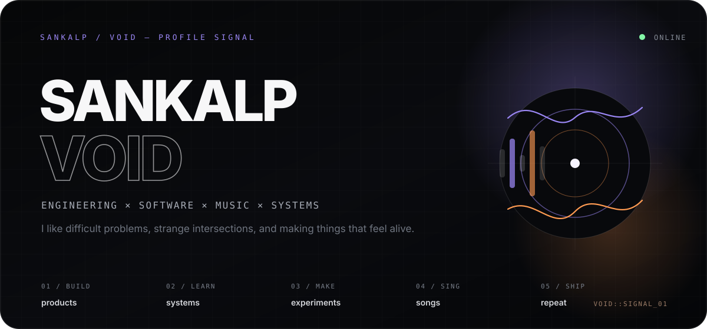
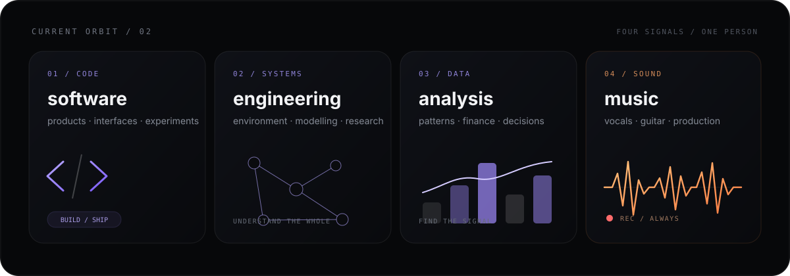
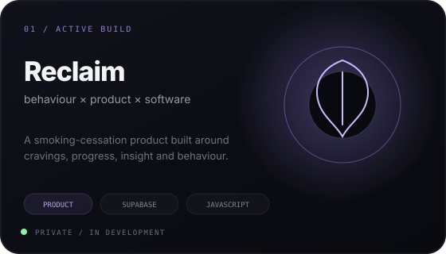
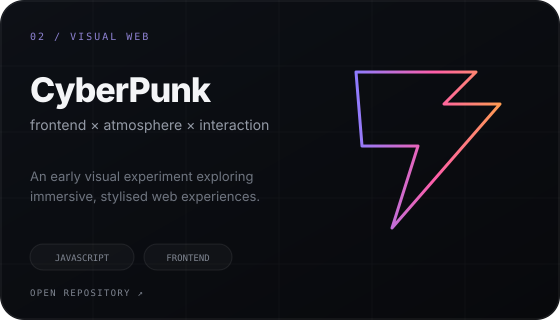
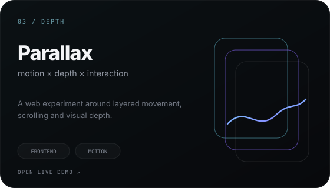
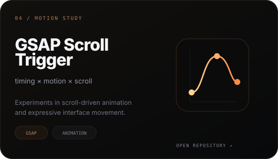
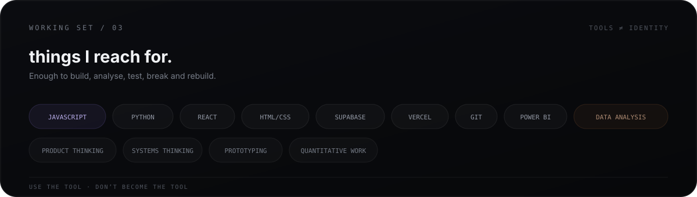
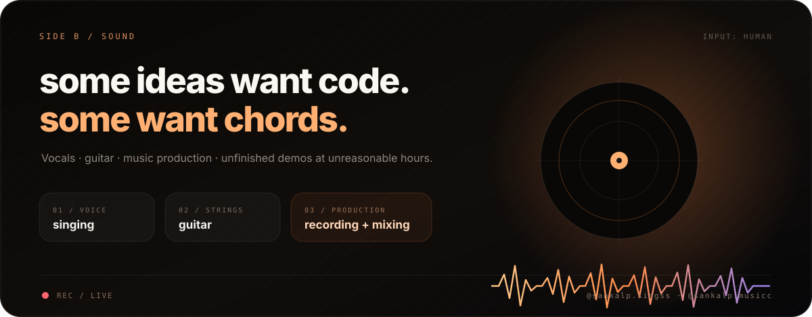
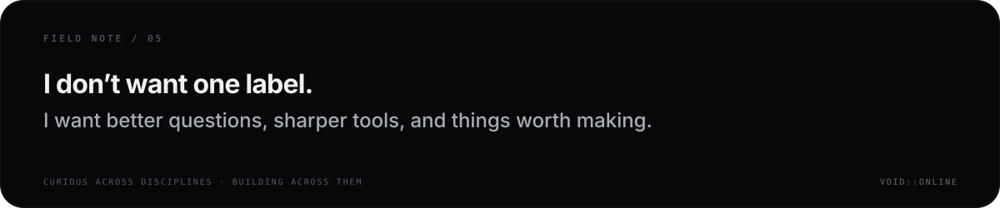

  

 

  <b>Sankalp Kushwaha</b> · engineering at IIT Bombay · building, analysing, experimenting & making noise

 

  

 

<code>SELECTED TRANSMISSIONS / WORK</code>

<table>
<tr>
<td width="50%" valign="top">
  
</td>
<td width="50%" valign="top">
  
</td>
</tr>
<tr>
<td width="50%" valign="top">
  
</td>
<td width="50%" valign="top">
  
</td>
</tr>
</table>

 

  

 

  

  
    <a href="https://www.instagram.com/sankalp.singss/">Instagram / @sankalp.singss</a>
    &nbsp;&nbsp;·&nbsp;&nbsp;
    <a href="https://www.youtube.com/@sankalp.musicc">YouTube / @sankalp.musicc</a>
  

 

  

